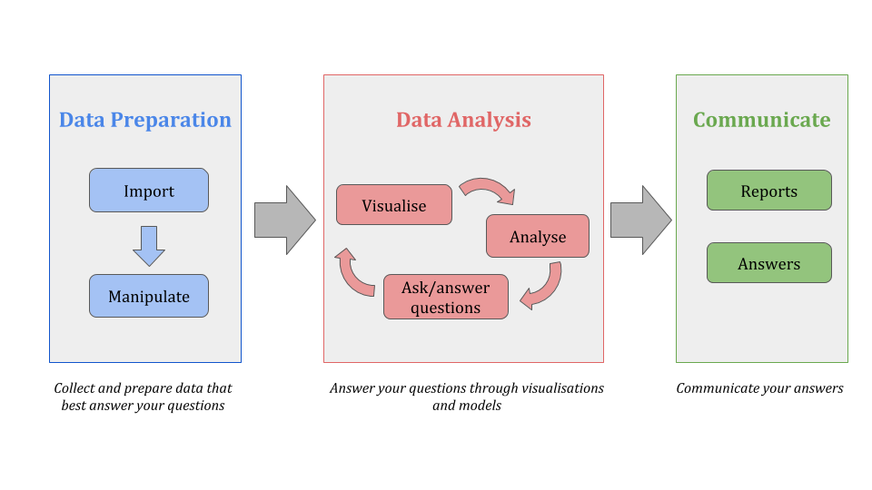

```{r setup, include=FALSE}
knitr::opts_chunk$set(echo = TRUE)
```

When I perform research and I work with data, I follow a simple and natural data analysis workflow which I like to see as divided into three main phases. The three phases are quite common among all data scientists/researchers although everyone has its own version. Here is mine:





### <span style="color:#3288dd">__1) Data Preparation__</span>

The first thing to do is to import your data and get it in the right shape and format. Both parts may take a fair bit of time.

#### _Importing data_

Importing data may be very easy, as you have the data in some file stored somewhere on your pc, as either a flat file or some specific common data format for data collectors such as STATA, SAS, etc. But the data import process may be complicated by the fact that you may have to retrive the data by connecting to a database or by accessing an API.


#### _Manipulating data_

First of all the imported data should represent individuals (i.e. statistical units) on the rows and variables (i.e. information collected on the individual, such as gender, income, etc) on the columns. So that each row is a different statistical unit and each column contains a different piece of information.

If the data is not organised as above, I suggest you transform it to be so.

Once you have imported data in the above shape, still many issues may occur. You may have to make small or large transformations to your data, from transformations regarding data formats to bigger transformations regarding, for instance the creation of new variables, or the substitution and identification of missing values.

Moreover, data may not be all on the same files, so you may have to deal with different tables hence make sure you can match information on such tables. Or you may have to collect specific variables from here and there and create the dataset you will be working with.

Note that this part may be fairly time consuming, but it is extremely important. This will be the base of your analysis and as many say "grabase in, garbage out", so one should pay lots of attention to this part.


### <span style="color:#fa6b62">__2) Data Analysis__</span>

Data Analysis is the fun part! Here is where your analytical skills come out the most.


#### _Data Visualisation and exploration_

First you need to understand the data by for instance printing tables and visualising it. This part is important and may go into your final report and may already answer a number of questions.


#### _Modelling_

Once data has been vizualized and understood, it is time to model the data in order to complete your analysis and answer more complicated questions that involve the interaction between more variables. The model may be simple comparison between the means of two or more groups or may be more sophisticated model.


### <span style="color:#6fa06a">__3) Reporting and Communicating__</span>    

Once you have finished the analysis you need to communicate what you have learned, to others in order to answer a research question. You may do so by builind a static or an interactive report, according to your needs. It is important to include plots and also explanation of what has been done.


