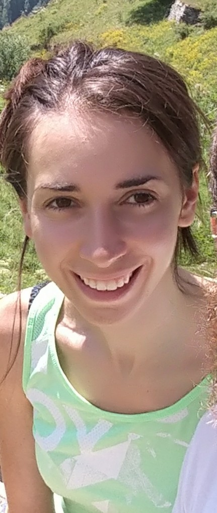

I am a Visiting Assistant Professor in the [Department of Statistics](https://statistics.ucdavis.edu/) at the University of California, Davis. Prior to joining UC Davis, I was a PostDoc in Social Statistics and Demography at the [Catholic University of Milan, Italy](https://docenti.unicatt.it/ppd2/en/docenti/59462/emanuela-furfaro/didattica), and I was also a freelance consultant for predictive data analysis, data visualisation and reporting. 

I am a Statistician with research interests that lie primarily at the intersection of Statistics, Demography and the Social Sciences. I like to study a problem using data to analyze reality, to find patterns, make informed decisions, and possibly predictions, tailoring existing methods to the problem under study or coming up with new ones if needed.

Since for my research, teaching and consulting activity, I mainly use `R`, this website was originally created to collect and share some small projects, some `R` code and some of my lessons, that I hope may be of use to others, but you can also find an overview of my [research](research.html) and of my most recent [teaching experience](research.html).

In my spare time, I love dancing tango. My favourite tango place in my hometown, Milan, Italy, is called [tango macao](http://www.macaomilano.org/spip.php?rubrique22). Still looking for my favourite one in California :)

{width=250px}

